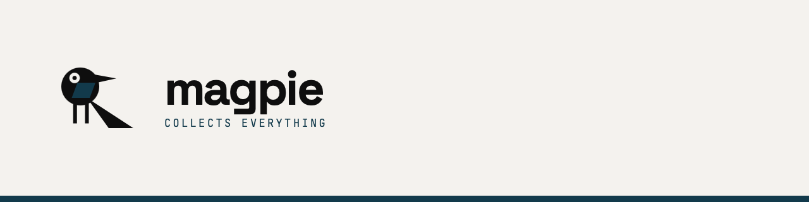

An open-source capture tool for AI-assisted work — a to-do list, clipboard, and scratchpad built
for people who work across ChatGPT, Claude, Cursor, and agent CLIs. Runs on macOS and Linux.
Agents can read and write your queue over MCP.

**Status: early development.** The capture core, MCP server, and CLI work end-to-end on macOS.
Linux support is planned but not yet verified, and there are no packaged releases yet — build
from source (see Development below). See [the design document](docs/design.md) for the full
architecture and roadmap.

## Why

Working with AI means constantly collecting small things you don't want to lose — an answer
worth keeping, a link, three follow-up prompts that occur to you while the current one is still
generating. They scatter across tabs and apps: ChatGPT, Claude, Cursor, a browser tab, a
terminal. magpie sits next to all of it, one hotkey away, and — unlike a plain clipboard manager
— lets your agents read and drain the queue directly instead of it being a dead end only human
hands can empty.

## Roadmap

Building toward a first packaged release in stages:

- **Capture core** — the stream, the `Now` working set, search, merge, tags, projects (done)
- **MCP server + CLI** — agents can read and write the queue over the Model Context Protocol,
  reusable prompt templates (done)
- **Packaging** — signed, installable builds for macOS and Linux
- **Screenshots + OCR**
- **Prompt packs** — shared, git-hosted collections of prompts

See [docs/design.md](docs/design.md) for the full architecture, the reasoning behind each design
decision, and the current status of each piece.

## License

GPL-3.0. See [LICENSE](LICENSE). The `magpie` name and any project logo are not covered by the
license and are reserved.

## Development

```sh
cd apps/desktop
pnpm install
pnpm tauri dev
```

Requires Rust (stable) and pnpm. macOS builds also require Xcode Command Line Tools.
